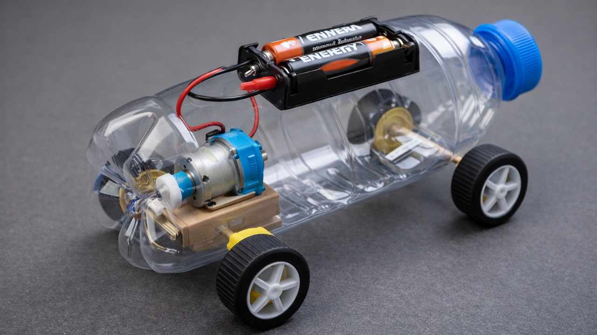

# carrinho
projeto de um veiculo mecátronico usando sucata de lixo eletrónico

  
##autores 
- Neidy
- Miguel
- Felipe R
- Felipe B

---
## simulador de projetos 
[simulador](https://www.tinkercad.com/things/ieTS64WyPwF-carrinho?sharecode=1lc3A4luFEoaoY_Igxvm-ZI8Ol4y8AkHb-MPt_bU8nA)
