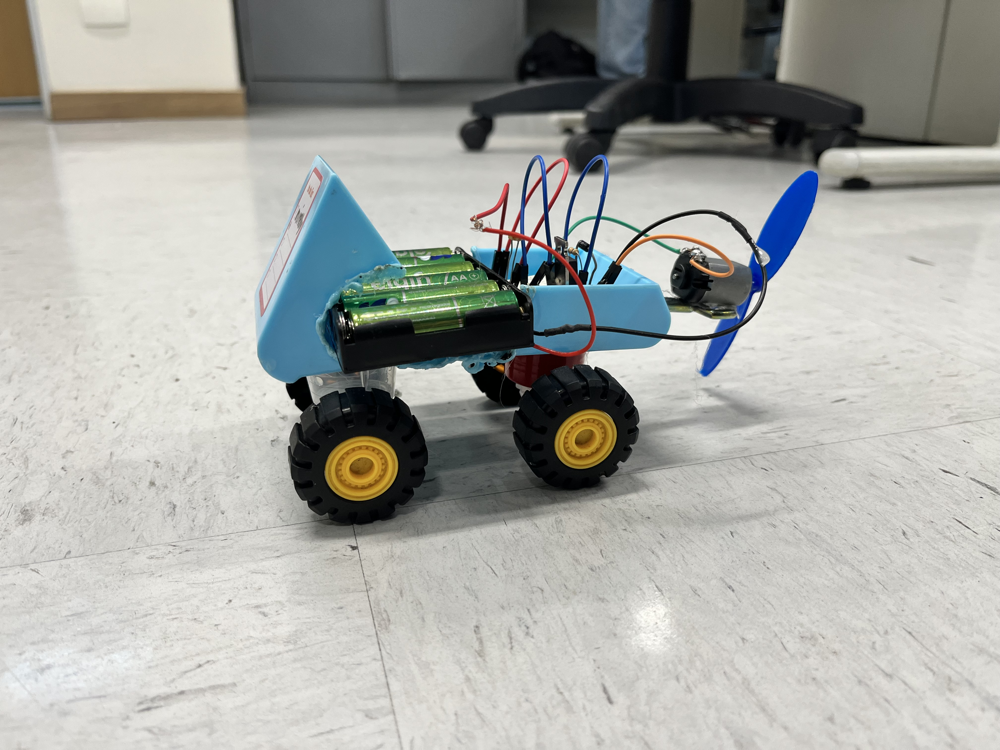

# carrinho
projeto de um veiculo mecátronico usando sucata de lixo eletrónico

  
##autores 
- Neidy
- Miguel
- Felipe R
- Felipe B

---
## simulador de projetos 
[simulador](https://www.tinkercad.com/things/ieTS64WyPwF-carrinho?sharecode=1lc3A4luFEoaoY_Igxvm-ZI8Ol4y8AkHb-MPt_bU8nA)

Introdução:
  O projeto tem como objetivo desenvolver um carrinho movido a energia elétrica e controlado por um sensor de luz, utilizando componentes simples de eletrônica. A proposta é aplicar, de forma prática, conhecimentos relacionados a circuitos elétricos, sensores, transistores e motores.
  O funcionamento do projeto ocorre por meio de quatro pilhas AA, que fornecem a energia necessária para o circuito. Um LDR (Light Dependent Resistor) é utilizado para identificar a intensidade da luz do ambiente. A partir da variação da luz, o LDR envia um sinal para o transistor TIP120, que controla a passagem de corrente elétrica para o motor.
  Além de possibilitar a construção de um pequeno veículo, o projeto permite compreender como diferentes componentes eletrônicos podem trabalhar em conjunto para transformar uma variação de luz em movimento. Dessa maneira, a atividade contribui para o aprendizado de conceitos de eletrônica e para o desenvolvimento de habilidades práticas de montagem, observação e resolução de problemas.
  
Materiais:
Parte mecânica
1 base de plástico, papelão rígido, EVA ou impressão 3D
4 rodas
2 eixos
1 motor 3v 6v
1 hélice para o motor
Cola quente
Fios

Parte eletrica:
R1	1	10 kΩ Resistor
U1	1	5.1 V Diodo Zener
Bat3	1	4 baterias, AA, não Bateria 1,5V
3	1	Placa de ensaio mini
M4	1	Motor CC
S2	1	Interruptor deslizante
U3	1	Fotodiodo
R3	1	Fotorresistor
Q2	1	TIP120

Passo a passo:
  Primeiramente, foram separados todos os materiais necessários para a construção do carrinho, como a base, as rodas, o motor, a hélice, as quatro pilhas AA, a protoboard, o LDR, o resistor, o transistor TIP120 e os fios para realizar as conexões.
  Em seguida, foi preparada a estrutura do carrinho. As quatro rodas foram fixadas na base de maneira que pudessem girar livremente. Depois, o motor foi colocado na parte traseira do carrinho e a hélice foi encaixada no eixo do motor.
  Após a montagem da estrutura, iniciou-se a construção do circuito elétrico na protoboard. Primeiro, foi colocado o transistor TIP120, que é responsável por controlar a corrente que chega ao motor. Em seguida, foi colocado o LDR, que funciona como um sensor capaz de perceber a intensidade da luz.
  Depois, o resistor foi conectado ao LDR para formar o circuito responsável pelo controle do transistor. O ponto de ligação entre o LDR e o resistor foi conectado à base do TIP120. Dessa maneira, a variação da luz detectada pelo LDR produz uma alteração no sinal que controla o transistor.
  Na sequência, foram realizadas as conexões da fonte de alimentação. As quatro pilhas AA foram colocadas no suporte, fornecendo aproximadamente 6 V ao circuito. O fio vermelho do suporte foi conectado ao polo positivo e o fio preto ao polo negativo, que funciona como o GND do circuito.
  Posteriormente, o motor foi conectado ao circuito via TIP120. O transistor permite controlar a passagem de corrente elétrica para o motor. Quando o circuito é energizado e as condições de iluminação fazem o transistor conduzir, o motor recebe corrente e começa a girar.
  Após realizar todas as conexões, o circuito foi testado antes de ser fixado definitivamente no carrinho. Foi verificado se o LDR respondia à mudança de iluminação e se o motor acionava corretamente.
  Por fim, a protoboard e o suporte das pilhas foram fixados na base do carrinho. Os fios foram organizados para evitar que ficassem soltos ou encostassem nas partes móveis. Depois de conferir todas as conexões, o carrinho ficou pronto para a demonstração do seu funcionamento.
  Assim, a montagem foi realizada passo a passo, começando pela estrutura física do carrinho, seguida pela montagem do circuito eletrônico, realização das conexões, testes e, por último, a fixação dos componentes na estrutura.
